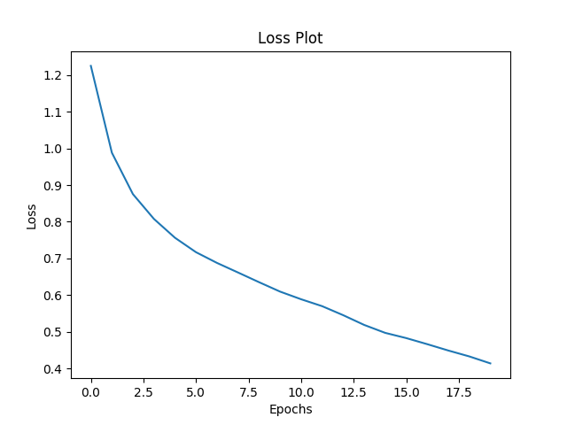
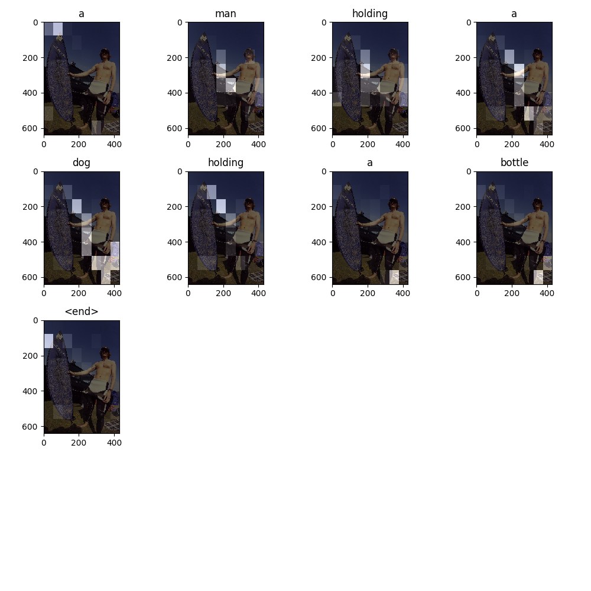
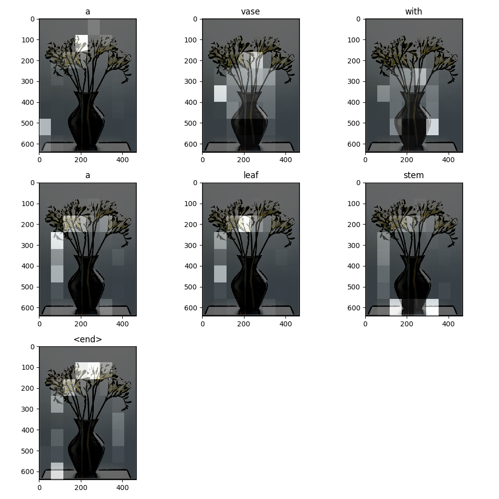
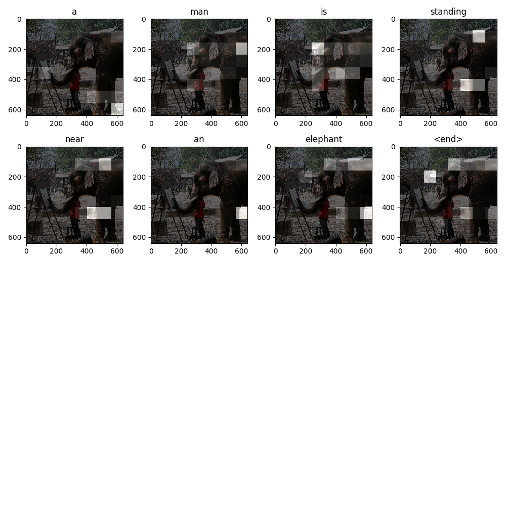
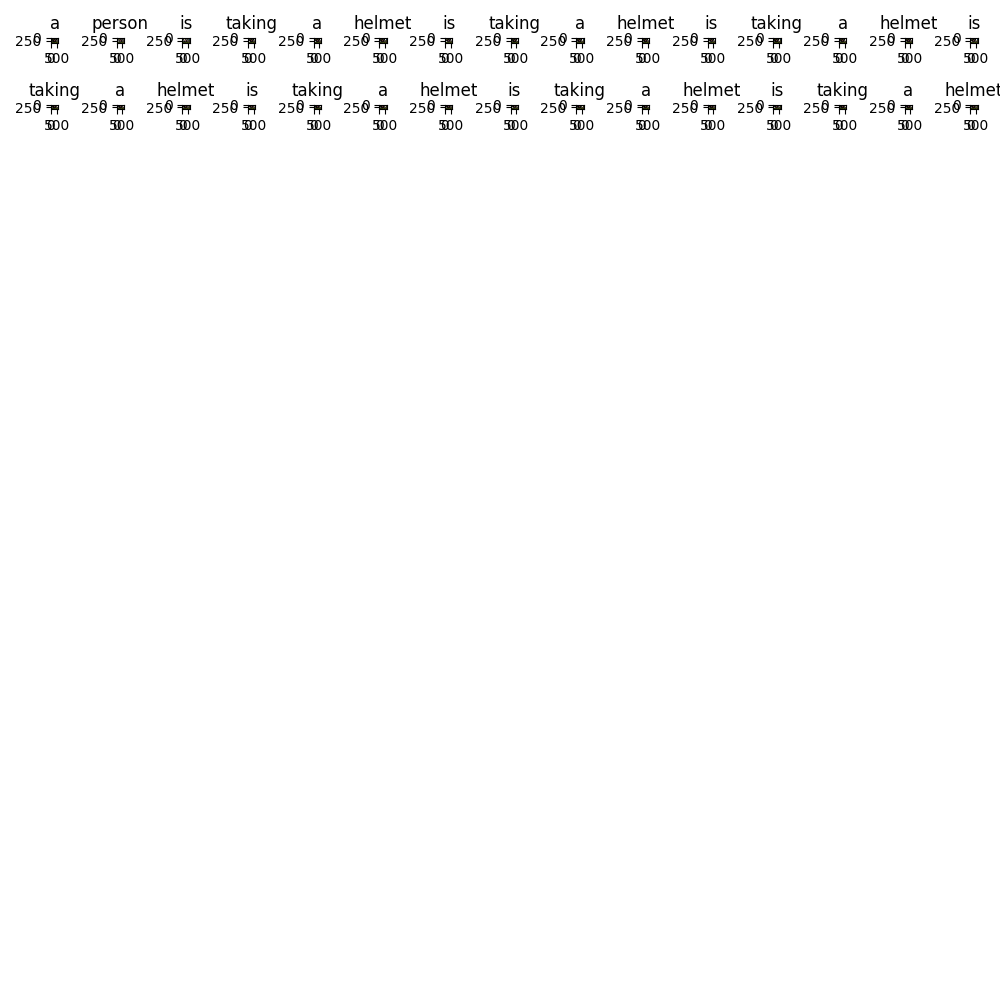
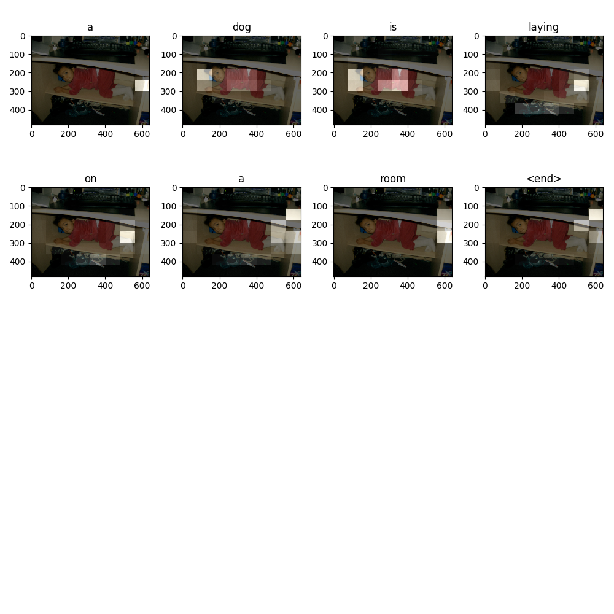

# Image-Captioning
CNN-Encoder and RNN-Decoder (Bahdanau Attention) for image caption or image to text on [MS-COCO](http://cocodataset.org/#home) dataset.

## Task Description 
Given an image like the example below, our goal is to generate a caption such as "a surfer riding on a wave".


To accomplish this, you'll use an attention-based model, which enables us to see what parts of the image the model focuses on as it generates a caption.


The model architecture is similar to [Show, Attend and Tell: Neural Image Caption Generation with Visual Attention](https://arxiv.org/abs/1502.03044).

## Main principle

The model consists of CNN-Encoder and RNN-Decoder. The CNN-Encoder is used to extract the information of the input image to generate the intermediate representation H, and then use RNN-Decode to gradually decode the H (using Bahdanau Attention) to generate a text description corresponding to the image.

模型由CNN-Encoder和RNN-Decoder组成，首先使用CNN-Encoder提取输入图片的信息生成中间表示H，然后使用RNN-Decode对H逐步解码（使用了BahdanauAttention）生成图片对应的文本描述。

```
Input: image_features.shape (16, 64, 2048)
---------------Pass by cnn_encoder---------------
Output: image_features_encoder.shape (16, 64, 256)

Input: batch_words.shape (16, 1)
Input: rnn state shape (16, 512)
---------------Pass by rnn_decoder---------------
Output: out_batch_words.shape (16, 5031)
Output: out_state.shape (16, 512)
Output: attention_weights.shape (16, 64, 1)
```

## Code test pass
+ Pyhon 3.6
+ TensorFlow version 2

## Usage

### 1. Preparing data

```
python data_utils.py
```

**Manual download of data**
If the code can't download the data automatically because of network reasons, you can download the data manually.

1. Downloading captions data from http://images.cocodataset.org/annotations/annotations_trainval2014.zip
2. unzip annotations_trainval2014.zip and move annotations to project
3. Downloading images data from http://images.cocodataset.org/zips/train2014.zip
4. unzip train2014.zip and move train2014 to project

### 2. Train model

```
python train_image_caption_model.py
```

### 3. Model inference

```
python inference_image_caption.py
```


## Experimental result

**loss**



**inference_image_caption outputs**








## Reference Code

> [image_captioning.ipynb](image_captioning.ipynb)

This notebook is an end-to-end example. When you run the notebook, it downloads the [MS-COCO](http://cocodataset.org/#home) dataset, preprocesses and caches a subset of images using Inception V3, trains an encoder-decoder model, and generates captions on new images using the trained model.

In this example, you will train a model on a relatively small amount of data—the first 30,000 captions  for about 20,000 images (because there are multiple captions per image in the dataset).


## Learn more

|Title|Content|
|-|-|
|[awesome-image-captioning](https://github.com/zhjohnchan/awesome-image-captioning)|A curated list of image captioning and related area resources.|
